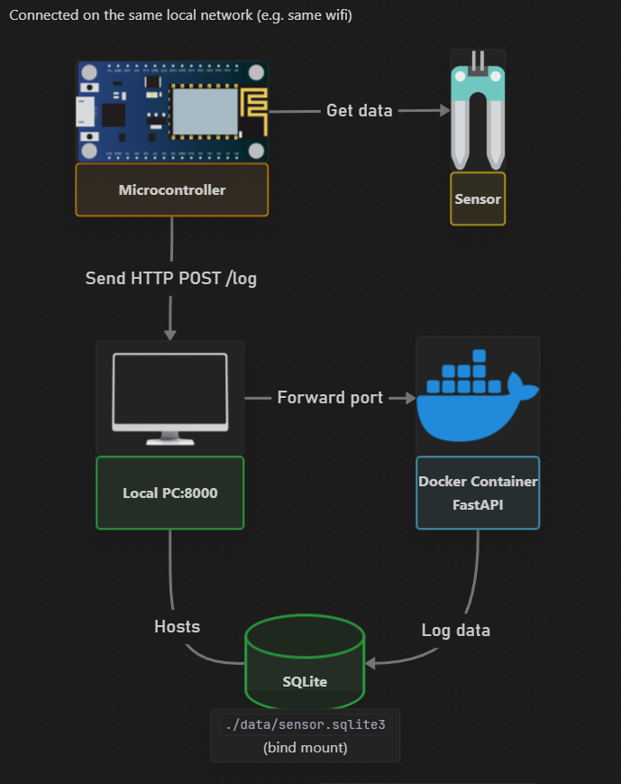

# umilog
Local backend server setup for ESP8266 sensor logging. It's built with FastAPI and SQLite.

This project contains both the backend and the .ino file for the ESP8266.

## How it works



## Project structure
```
│   .gitignore
│   Dockerfile
│   poetry.lock
│   pyproject.toml      
│   README.md
│
└───src\umilog
    │   database.py    # sqlite setup and CRUD functions
    │   main.py        # Logging and app routes logic
    │   umilog.ino     # ESP8266 flashable code
    │   __init__.py
    │
    └───data           # sensor data
```

## Installation

### Requirements

- Docker ([Download Page](https://docs.docker.com/get-docker/))
- Arduino IDE (for uploading the `.ino` file) ([Download Page](https://www.arduino.cc/en/software/))

### Backend (FastAPI + SQLite)

1. Clone the repository
```bash
git clone https://github.com/figdavi/umilog.git
cd umilog
```

2. Build the docker image
```bash
docker build -t umilog .
```

3. Run the container fowarding on port 8000
```bash
docker run -p 8000:8000 umilog
```

### Microcontroller (ESP8266)

#### Arduino Library Requirements

All libraries are already part of the core package for the ESP8266 board. 

On the Arduino IDE:

1. Go to `Tools` > `Board` > `Boards Manager`

2. Search for ESP8266 and install the `ESP8266 by ESP8266 Community` package

#### Flashing the Microcontroller

1. Open the `.ino` file (in `src/umilog/umilog.ino`) in the Arduino IDE.
2. Set the correct board and port (e.g., NodeMCU 1.0).
3. Replace the placeholder Wi-Fi credentials in the sketch.
4. Upload the code to the ESP8266.
5. Ensure the FastAPI server is reachable at the IP and port defined in the sketch (`http://<host-ip>:8000/log`).